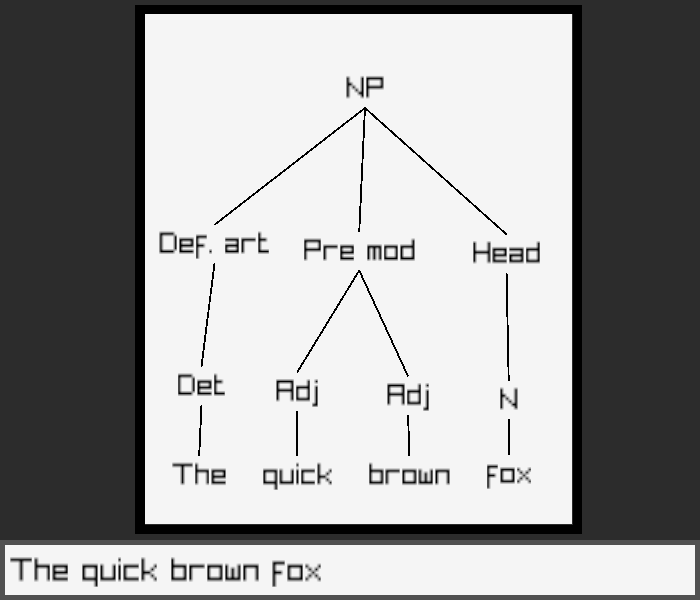
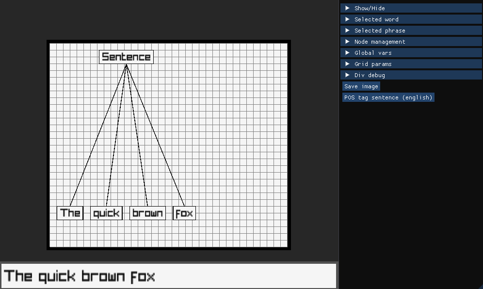

# Syntax Tree Generator

## Build
````
1  mkdir build && cd build

2  cmake ..

3  cmake --build . (eller bare "make")
````

## Run
````
./SyntaxTreeGen
````

## Keybinds
````
A     - Add node at mouse pos
C     - Connect the selected node with the previously selected node
X     - Delete selected node
ENTER - Start typing in selected node
ESC   - Exit program (remove bind)
````

## Mouse
````
Ctrl+leftMouse or rightMouse to drag the camera
````

---

### Export example:


### Application example:

